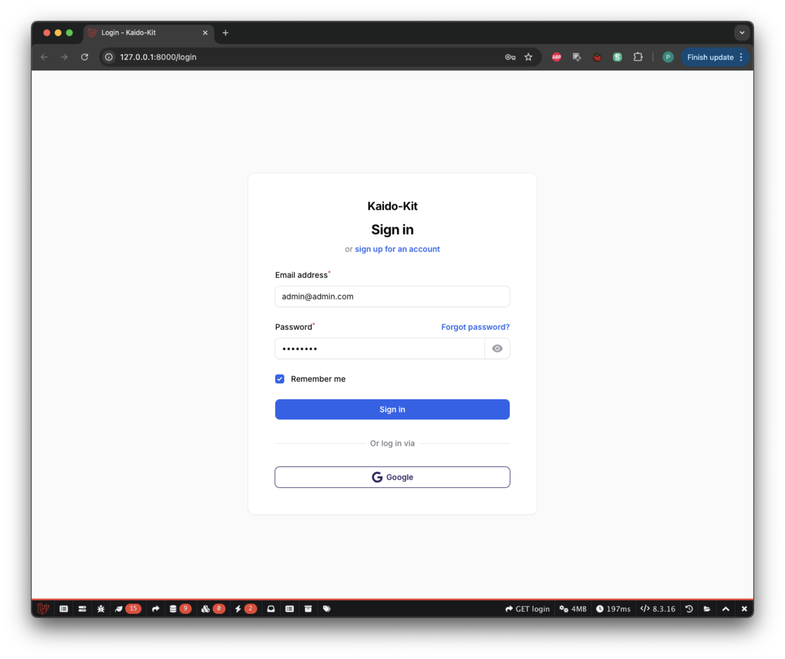
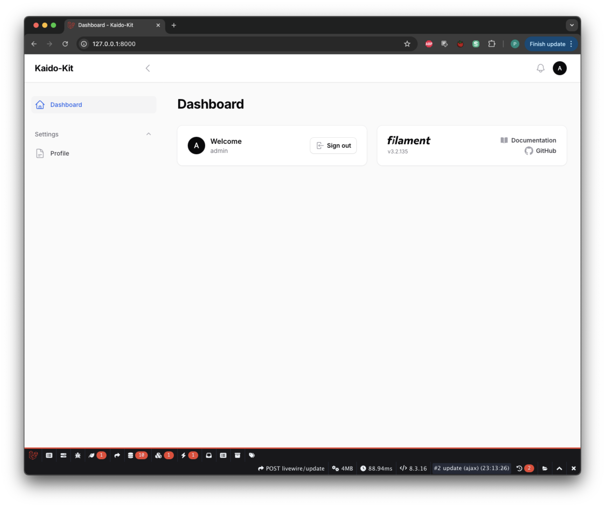
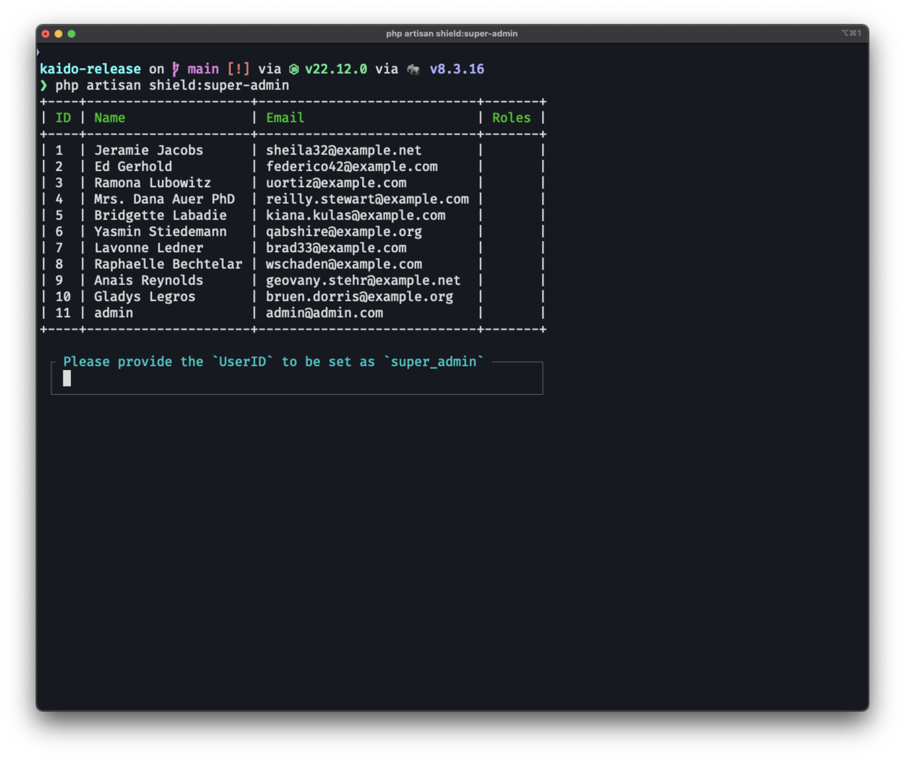
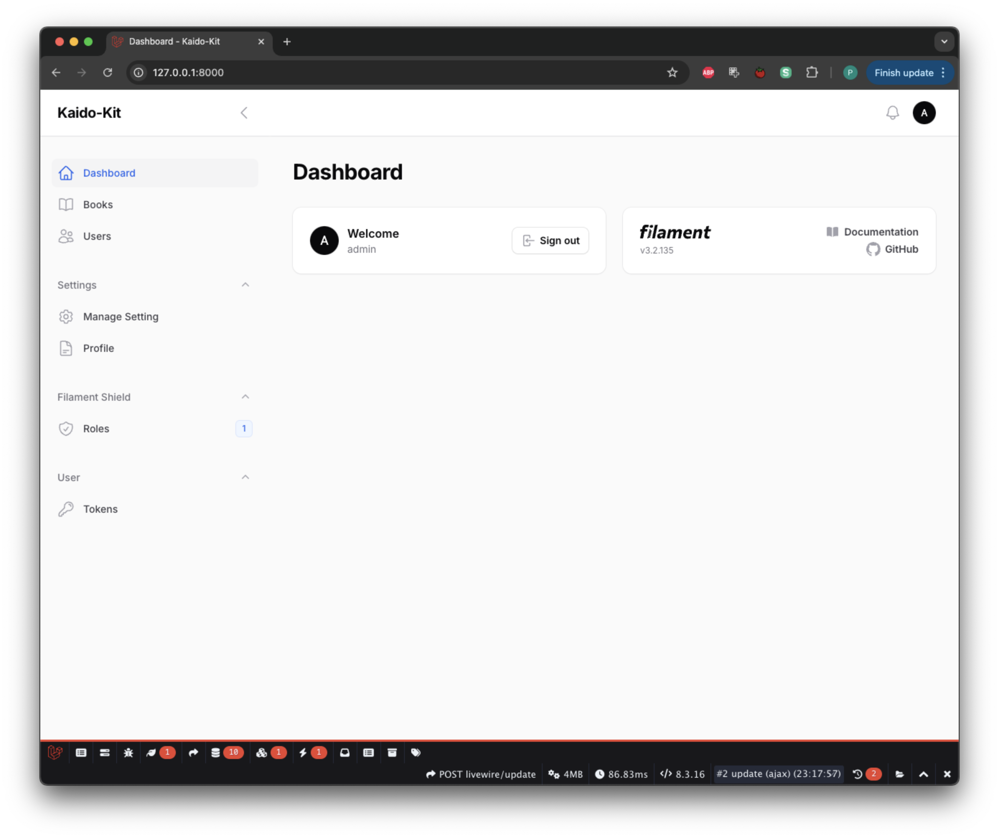

# 🚀 Proyek ERP Lintas Riau Prima

Sistem ERP komprehensif yang dibangun untuk Lintas Riau Prima menggunakan framework FilamentPHP. Aplikasi ini mengelola operasi distribusi bahan bakar, pelacakan inventaris, dan proses bisnis dengan antarmuka admin yang intuitif dan fitur-fitur yang kuat untuk efisiensi operasional.


### 📁 Manajemen Media & Konten

- 🖼️ Terintegrasi dengan [Filament Media Library](https://filamentphp.com/plugins/filament-spatie-media-library)
    - Proses penanganan media yang mudah
    - Dukungan [Spatie Media Library](https://spatie.be/docs/laravel-medialibrary)

### ⚙️ Konfigurasi & Pengaturan

- 🎛️ Manajemen plugin dinamis melalui [Filament Settings](https://filamentphp.com/plugins/filament-spatie-settings)
    - Aktifkan/nonaktifkan fitur dengan mudah
    - Integrasi [Spatie Laravel Settings](https://github.com/spatie/laravel-settings)

## 🚀 Panduan Cepat

1. Clone project dari github

    ```bash
    git clone https://github.com/digisionOffice/LRP-Project.git
    ```

2. Install Composer

    ```php
    composer install
    ```

3. Install Npm

    ```php
    npm install
    ```

4. Salin .env

    ```php
    cp .env.example .env
    ```

5. Konfigurasi database di .env

    ```php
    DB_CONNECTION=mysql
    DB_HOST=127.0.0.1
    DB_PORT=3306
    DB_DATABASE=lrp_fuel_management
    DB_USERNAME=root
    DB_PASSWORD=
    ```

6. Konfigurasi ID klien dan rahasia Google Sign In (opsional)

    ```php
    #google auth
    GOOGLE_CLIENT_ID=
    GOOGLE_CLIENT_SECRET=
    GOOGLE_REDIRECT_URI=http://localhost:8000/admin/oauth/callback/google
    ```

7. Konfigurasi pengiriman email menggunakan resend (opsional)

    ```php
    #resend
    MAIL_MAILER=resend
    MAIL_HOST=127.0.0.1
    MAIL_PORT=2525
    MAIL_USERNAME=null
    MAIL_PASSWORD=null
    MAIL_ENCRYPTION=null
    RESEND_API_KEY=
    MAIL_FROM_ADDRESS="admin@domain.com"
    MAIL_FROM_NAME="${APP_NAME}"
    ```

8. Migrasi database

    ```php
    php artisan migrate --seed
    ```

9. Jalankan Aplikasi

    ```script
    composer run dev
    ```

11. Jika berhasil dijalankan, Anda akan melihat antarmuka login ini

    

12. Setelah masuk, akan terlihat seperti ini (belum banyak tapi sedang dalam pengembangan :) )

    

13. Langkah selanjutnya adalah mengatur RBAC, pertama generate role dan permission

    ```php
    php artisan shield:generate --all
    ```

14. Akan ditanyakan panel mana yang ingin Anda generate permission/policies, pilih panel admin.
15. Atur super admin menggunakan perintah ini

    ```php
    php artisan shield:super-admin
    ```

    

16. Pilih user super admin Anda dan login kembali.

    

## Keamanan
Atur Debug aplikasi ke false di file .env
```php
APP_NAME="Kaido-Kit"
APP_ENV=local
APP_KEY=base64:gWUd7RPrCZm6iu7qFddY3039BQLroNHJ0nqKcBr8eeA=
APP_DEBUG=false
APP_TIMEZONE=UTC
APP_URL=https://localhost:8000
```

